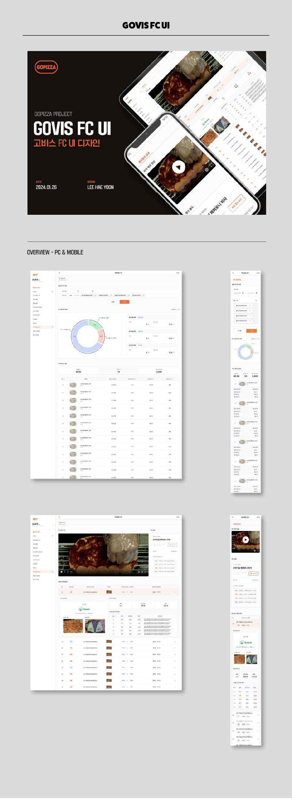

# GOVIS Franchisee Platform 2.0



## 프로젝트 개요

GOVIS Franchisee는 GOPIZZA 가맹점주를 위한 통합 관리 플랫폼입니다. 매출, 주문, 쿠폰, 공지사항 등 가맹점 운영에 필요한 모든 정보를 한 곳에서 효율적으로 관리하고 모니터링할 수 있도록 설계되었습니다. 직관적인 데이터 시각화와 사용자 친화적인 인터페이스를 통해 비즈니스 인사이트를 쉽게 얻을 수 있습니다.

## 핵심 기능

- **실시간 대시보드**: 연간, 주간, 전일 매출 현황을 한눈에 파악
- **매출 분석**: 시간대별, 요일별, 월별 매출 데이터 시각화
- **주문 유형 분석**: 배달, 내점, 포장 등 주문 유형별 비율 확인
- **주문 채널 분석**: 다양한 주문 채널별 실적 비교
- **공지사항 관리**: 본사의 중요 공지를 팝업 형태로 제공
- **쿠폰 관리**: 발행된 쿠폰의 사용 현황 및 관리
- **캘린더 기능**: 중요 일정 관리 및 확인
- **게시판 시스템**: 커뮤니케이션 및 정보 공유를 위한 게시판


## GOVIS Franchisee 포트폴리오 영상

[포트폴리오 살펴 보기](https://www.youtube.com/watch?v=kpD2ySE8nUo)


## 기술 스택

### 프론트엔드
- **Next.js 12.2.0** - 서버 사이드 렌더링 지원 React 프레임워크
- **React 18.2.0** - 사용자 인터페이스 구축을 위한 JavaScript 라이브러리
- **TypeScript 4.7.4** - 정적 타입 검사를 통한 코드 안정성 확보
- **MobX** - 상태 관리 라이브러리
- **React Query** - 서버 상태 관리 및 데이터 페칭
- **Emotion/Styled Components** - CSS-in-JS 스타일링

### 차트 및 시각화
- **Recharts** - 데이터 시각화 라이브러리

### 유틸리티
- **Axios** - HTTP 클라이언트
- **Day.js** - 날짜 관리 라이브러리
- **React Hook Form** - 폼 상태 관리
- **React Toastify** - 알림 메시지 표시

## 프로젝트 구조

```
GovisFranchisee/
├── components/         # 재사용 가능한 컴포넌트
├── lib/                # 유틸리티 함수 및 상수
├── pages/              # 페이지 정의
│   ├── board/          # 게시판 관련 페이지
│   ├── calendar/       # 캘린더 관련 페이지
│   ├── gomarket/       # 고마켓 관련 페이지
│   ├── notice/         # 공지사항 페이지
│   ├── recipe/         # 레시피 관련 페이지
│   ├── _app.tsx        # Next.js 앱 컴포넌트
│   ├── home.tsx        # 메인 대시보드
│   ├── index.tsx       # 로그인 페이지
│   └── [기타 페이지]    # 기타 기능 페이지
├── public/             # 정적 파일 (이미지, 아이콘 등)
├── src/                # 소스 코드
│   └── mobx/           # MobX 상태 관리
├── styles/             # 글로벌 스타일
└── [설정 파일들]        # 프로젝트 설정 파일
```

## 설치 및 실행 방법

### 환경 설정
```bash
# nvm 설치
curl -o- https://raw.githubusercontent.com/nvm-sh/nvm/v0.39.1/install.sh | bash
source ~/.bash_profile

# Node.js 및 npm 설치
nvm install --lts

# Yarn 설치
npm install -g yarn

# PM2 설치
npm install -g pm2
```

### 개발 환경
```bash
# 의존성 설치
yarn install

# 개발 서버 실행 (최초)
yarn dev

# 개발 서버 실행 (이후)
yarn start
```

### 프로덕션 환경
```bash
# 의존성 설치
yarn install

# 프로덕션 빌드 (최초)
yarn dev

# 프로덕션 빌드 (이후)
yarn start
```


## 주요 개발 특징

### 데이터 시각화
- 차트 및 그래프를 활용한 매출 데이터의 직관적 표현
- 시간대별, 요일별, 채널별 분석을 통한 비즈니스 인사이트 제공

### 반응형 디자인
- 다양한 디바이스에서 최적화된 사용자 경험 제공
- 관리자 대시보드에 적합한 레이아웃 설계

### 상태 관리
- MobX를 활용한 전역 상태 관리로 로그인 및 사용자 정보 관리
- React Query를 통한 효율적인 API 통신 및 캐싱

### 보안
- 토큰 기반 인증 시스템 구현
- 인증된 사용자만 접근 가능한 보안 라우팅

## 개발자 정보

이 프로젝트는 GOPIZZA 프랜차이즈 비즈니스를 지원하기 위한 웹 애플리케이션으로, Next.js와 TypeScript를 기반으로 구축되었습니다. 프랜차이즈 점주들에게 필요한 비즈니스 데이터와 도구를 제공하는 통합 플랫폼입니다.

